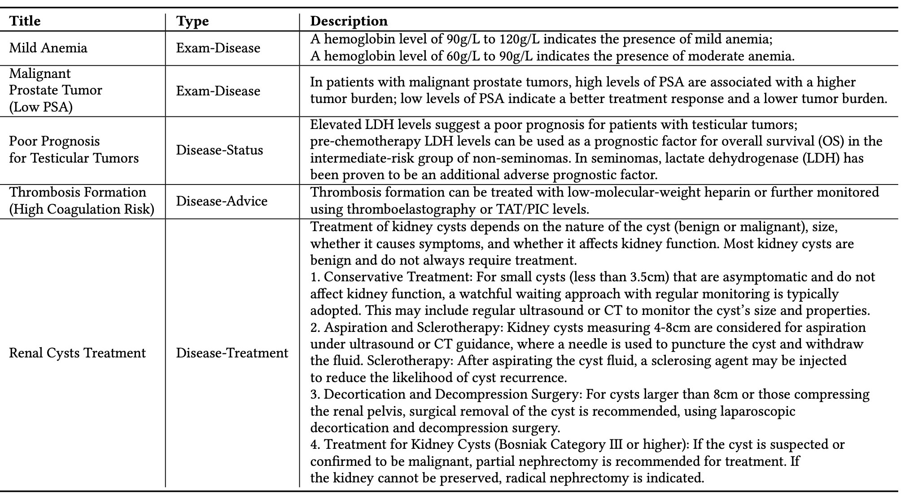

# MedDQA benchmark
Official repository of [[RJUA-MedDQA: A Multimodal Benchmark for Medical Document Question Answering and Clinical Reasoning](https://arxiv.org/abs/2402.14840)] 

MedDQA is a pioneering and extensive benchmark for medical report understanding in Chinese, with a special emphasis on urology. It stands out as the largest real-world medical report VQA dataset, offering high-quality OCR results and detailed annotations. The dataset is designed to improve Large Multi-modal Models (LMMs) by enabling them to accurately interpret medical report across a wide range of layouts and to perform robust clinical reasoning based on given medical knowledge.

**The unique features of MedDQA include:**
* **Large Layout Variability**: The dataset contains diverse image types such as photographs, scanned PDFs, and screenshots. These images are sourced from various public domains and exhibit complex layouts and varying qualities, simulating real-world conditions. The dataset includes images that may have reduced quality due to factors like rotation, skewing, text blurriness, or incomplete information, reflecting the challenges found in practical scenarios.
* **Real-world Focus**: The dataset captures real-world medical scenarios, providing a practical and authentic set of challenges for AI models.It features two main tasks: Image Content Recognition VQA and Clinical Reasoning VQA—that assess a range of model capabilities from data extraction to complex clinical reasoning.
* **Clinical Expert Annotation**: The dataset has been meticulously annotated by urology specialists, ensuring the contextual reasoning tasks are grounded in clinical expertise. This ensures that the data is not only accurate but also reflective of the nuances and complexities of real clinical practice.
* **Medical Context Base for Clinical Reasoning**: The dataset provides a knowledge fact base that includes logical chains for disease diagnosis, staging, and treatment advice. This information is primarily derived from clinical experience and the official Urological Disease Diagnosis and Treatment Guidelines, aiming to bridge the gap between urological disease diagnosis in clinical settings and research communities.

<p align="center">
  
&nbsp; &nbsp; &nbsp; &nbsp;
  
</p>

# About MedDQA
The RJUA-MedDQA dataset contains a total of 2000 images, of which 402 are screenshot, 619 are scanned-PDF, and the remaining 979 are photos taken by patients. Reports in screenshot and scanned-PDF format ensure the integrity and clarity of information; on the other hand, reports captured in photographs may exhibit some degree of quality degradation caused by issues such as rotated or skewed angles, blurred text, or incomplete information, which reveals real-world problems. Medical reports can be grouped into two main categories, namely Laboratory Report and Diagnostic(Clinical) Report. 

<p align="center">
     <br>
</p>

Top 25 Diseases in Laboratory Reports (Left) and Diagnostic Reports (Right)

<p align="center">
     <br>
</p>

## Data Generation Pipeline
<p align="center">
     <br>
</p>

## Task Overview
We introduce RJUA-MedDQA dataset for the medical report understanding question-answering problem requiring models to possess the capability to interpret textual and tabular content within images, as well as reasoning capacity given a piece of medical knowledge. We propose two main tasks to evaluate different capabilities of LMMs: (1) Image Content Recognition; (2) Clinical Reasoning. 

**Task 1: Image Content Recognition VQA (Without Context):** This task tests the models' ability to accurately extract the content presented in medical reports, which includes both textual and tabular data
* **Subtask 1 Entity Recognition:** This involves accurately extracting key information, such as age, examination descriptions and conclusions.
* **Subtask 2 Table Interpretation:** This requires the model to parse tabular data within laboratory reports (e.g. test results and reference intervals).
* **Subtask 3 Table Numerical Reasoning:** This requires the model to apply quantitative reasoning to identify and interpret abnormal indicators of laboratory reports.

**Task 2: Clinical Reasoning VQA (With Context):** This task poses a significant challenge to models by demanding not only an accurate extraction of the image content but also the professional clinical diagnoses that combine the report's information with a piece of medical knowledge (context) which support the reasoning process. This task includes both multiple-choice questions (MC) and short-answer (SA) formats for evaluation.
* **Subtask 1 Disease Diagnosis:** This requires the model to perform disease diagnosis based on abnormal indicators in laboratory tests (e.g. blood tests), and medical knowledge to support the diagnostic process. 
* **Subtask 2 Disease Status Diagnosis:**  This requires the model to assess the severity and stage of disease such as tumor staging based on findings in report and provided medical knowledge.
* **Subtask 3 Advice or Treatment:** This requires the model to generate advice such as further examinations or treatment plans.

## Medical Knowledge Fact Base (Context Base)
The context base provides essential medical knowledge to support clinical reasoning task within the domain of urology and laboratory. Every piece of context is made up of three components: *type*, *title*, and *description*.
* **Title:** It refers to the name or label given to a specific disease, examination finding, or health-related topic, such as "Mild Anemia" or "Renal Cysts Treatment"
* **Type:** It refers to the type of a context. For example, "Disease-Advice" offers advice for controlling or alleviating a health issue, and "Disease-Treatment" provides specifics on the method to addressing a medical disease.
* **Description:** It offers detailed medical knowledge to arrive at the conclusion mentioned in the title, such as the criteria for diagnosing "Mild Anemia".

<p align="center">
     <br>
</p>

## Evaluation
We have implemented task-specific metrics within the dataset, which allows us to capture the distinct nuances of LMM performance. For Table QA, Table Numerical Reasoning (NR) QA and Clinical Reasoning Multiple Choice (MC), we adopt soft accuracy which means the predict answer is considered to be correct if it contains the ground truth. For Entity QA and Clinical Reasoning Short Answer (SA), we will adopt ROUGE-L. 

## Leaderboard
We select 5 different multi-modality models and benchmark them on the dataset. The models we have selected cover a broad spectrum of strategies and architectures, effectively illustrating the current state-of-the-art in multimodal understanding. In addition to LMMs, we conduct comparative experiments on a set of strong LLMs by using image-text generated by ESRA method to further investigate the limitations and potential of current LMMs.
<p align="center">
     <br>
</p>

## Examples
<p align="center">
     <br>
</p>

<p align="center">
     <br>
</p>

<p align="center">
     <br>
</p>

<p align="center">
     <br>
</p>

<p align="center">
     <br>
</p>


# Release
- [Apr 15] 🔥 sampled MedDQA is released. See `/samples`  in detail

# Contacts 
For any questions or suggestions about the dataset, please contact us at: [jincongyun.jcy@alipay.com](jincongyun.jcy@alipay.com), [chichenfei@renji.com](chichenfei@renji.com), [huangyiran@renji.com](huangyiran@renji.com), [fancong.fan@antgroup.com](fancong.fan@antgroup.com)

# Acknowledgement
If you find MedDQA is useful for your research and applications, please cite using this BibTeX:
```bibtex
@misc{jin2024rjuameddqa,
      title={RJUA-MedDQA: A Multimodal Benchmark for Medical Document Question Answering and Clinical Reasoning}, 
      author={Congyun Jin and Ming Zhang and Xiaowei Ma and Li Yujiao and Yingbo Wang and Yabo Jia and Yuliang Du and Tao Sun and Haowen Wang and Cong Fan and Jinjie Gu and Chenfei Chi and Xiangguo Lv and Fangzhou Li and Wei Xue and Yiran Huang},
      year={2024},
      eprint={2402.14840},
      archivePrefix={arXiv},
      primaryClass={cs.CL}
}
```
Note: When using the dataset, please ensure compliance with relevant laws, regulations, and data privacy policies.

# License
The codes in this repo are available under GNU Affero General Public License. The dataset is available under Attribution-NonCommercial-ShareAlike 4.0 International (CC BY-NC-SA 4.0), which means you may not use the dataset for commercial purposes, and if you remix, transform, or build upon the dataset, you must distribute your contributions under the same license.
